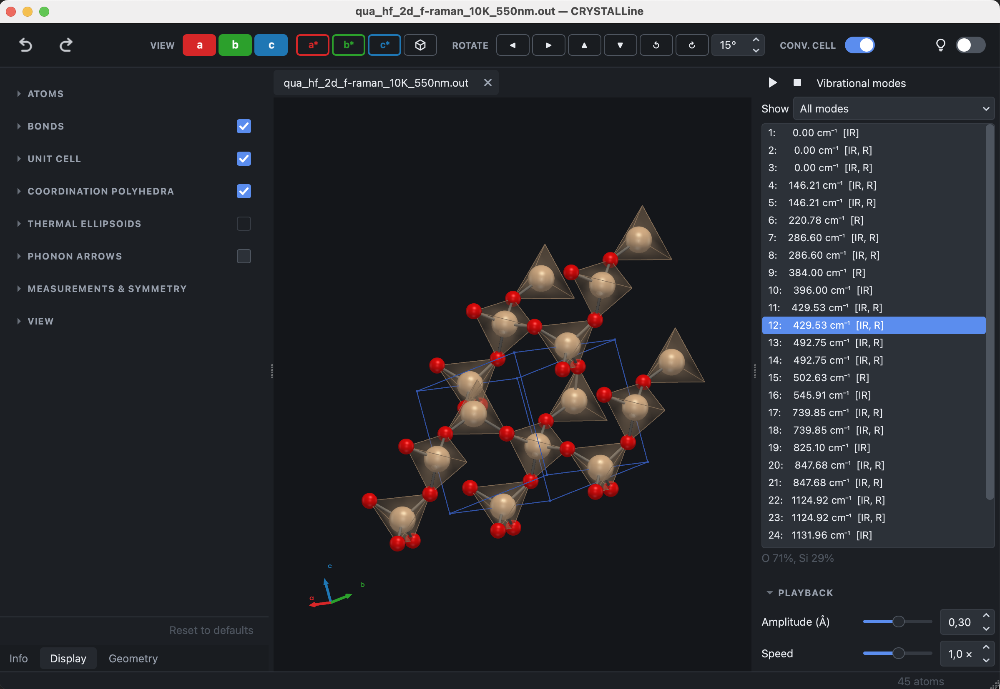

# First steps

## Opening a file

**File → Open…** ({kbd}`Ctrl+O`) reads a CRYSTAL output (`.out`), a geometry
file (`.gui`, `.f34`) or a crystallographic information file (`.cif`). A file
dropped on the window is opened in the same way.

No output to hand? [Installation](install.md#an-example-to-open) offers a small
MgO calculation to open.

If the output contains a vibrational calculation, phonon modes are read with it.
If it does not, the geometry alone is shown and the remaining functions are
unaffected.

## Several files at once

Each file opens in a tab of its own above the 3D view, so several can be open
together and compared by switching between them; several files can be chosen
in the Open dialog, or dropped, at once. The window starts with an empty tab,
which the first file takes over.

A tab keeps everything that belongs to its file: the view and its camera, the
cell and supercell shown, the phonon modes, the plots, measurements and lattice
planes, the undo history and the display settings. The panels around the view
show the tab on screen. A new tab starts from the display settings of the one
open when it was made, and each changes independently from then on; editing
mode applies to whichever tab is shown.

Tabs are named after their files, with the folder added when two files share a
name — `0GPa/fort.34` and `1GPa/fort.34` — and can be dragged to reorder them.
**File → Close tab** ({kbd}`Ctrl+W`) closes the one on screen, and **View → Next
tab** and **Previous tab** ({kbd}`Ctrl+Tab`, {kbd}`Ctrl+Shift+Tab`) move between
them. While a plot or an orbital is being computed, the tabs wait for it.

## Working in the calculation's folder

CRYSTAL writes more than the output file. Several external units might be 
generated depending on the specific task. CRYSTALLine looks for these beside 
the output that is open, and works better when they are all in one folder:

- The **Electronic bands & DOS** dialog lists the band and density-of-states
  files it finds there, recognises them by their contents, and pairs a band 
  structure with a density of states computed from the same SCF.
- The file dialogs of the other plots open in that folder.
- Anharmonic wavefunctions are found without being asked for.

So keeping a calculation and everything it produced in one directory, rather
than moving the output somewhere on its own, is what allows the program to
offer the right file instead of an empty dialog.

## The main window

The window is divided into dockable panels:

| Position | Panel | Contents |
| --- | --- | --- |
| Left | **Info** | space group or layer group, lattice parameters, density, and a summary of the calculation |
| Left | **Display** | the settings of the 3D view |
| Left | **Geometry** | distances, angles, dihedrals and planes |
| Right | **Phonons** | the list of vibrational modes and the animation controls |
| Bottom | **Plots** | the property plots, in tabs |

**View → Panels** lists every panel with a tick beside it: clearing the tick
puts that panel away and setting it again brings it back, so the window can be
narrowed to the panels a particular job needs. **View → Restore all panels**
brings back everything at once.

## Controlling the view

The structure is rotated by dragging, zoomed with the scroll wheel and
translated by dragging with the middle button (or with {kbd}`Shift` held down).

The toolbar contains three groups: **VIEW**, which orients the structure along
the **a**, **b** or **c** axis or, as in VESTA, along **a\***, **b\*** or
**c\*** — the normal to the bc, ca or ab plane, which shows that face of the
cell square-on — and returns it to a view of the whole; **ROTATE**, which turns
it by a fixed step, 15° unless changed in the adjacent box; and **CONV. CELL**,
which switches between the crystallographic and the primitive cell. In an
orthogonal cell a and a\* coincide; in a monoclinic or triclinic one, looking
down a shows the bc face foreshortened and looking down a\* shows it at its true
shape. For a slab, **c\*** looks straight down onto the layer.

**View → Appearance** selects the light or dark interface, or follows the
system setting.

## Next

[The 3D view](viewer.md) describes the Display panel, [Editing
structures](editing.md) the modification of a structure, [Symmetry](symmetry.md)
the analysis and reduction of its symmetry, [Phonons](phonons.md) the
vibrational modes, [CRYSTAL input builder](inputs.md) the preparation of new
calculations and [Property plots](plots.md) the plotting of the results.
