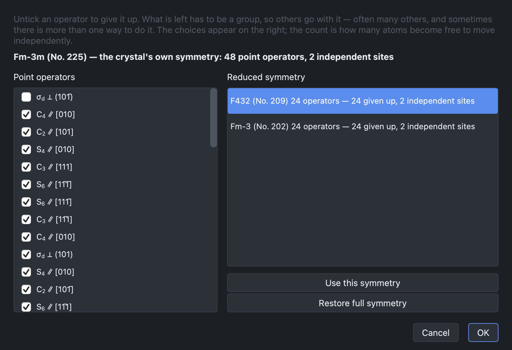

# Symmetry

## The Info panel

The symmetry reported depends on the periodicity of the structure:

| Structure | Symmetry |
| --- | --- |
| crystal (3D) | space group |
| slab (2D) | layer group |
| polymer (1D) | the repeat length only — see below |
| molecule (0D) | point group |

The panel also reports the point group, the lattice parameters, the cell volume
or area, the density and the formula. All of them are recomputed when the
structure is edited.

A polymer's symmetry is a rod group, and no rod group is named here: the
symmetry library the program uses (spglib) implements the 230 space groups and
the 80 layer groups, but not the 75 rod groups. A 1D structure is therefore
reported by its repeat length and its formula, and its symmetry elements are
listed by the point-symmetry analysis below like those of any other structure.
A deck written for a polymer uses rod group 1, with every atom listed, which is
always valid. Reducing the symmetry of a polymer is refused for the same reason.
One-dimensional systems are not otherwise supported; see
[Not supported yet](index.md#not-supported-yet).

### Which cell is described

A space group can be written in several settings, and a crystal computed in a
non-standard one has lattice parameters its standard description does not
share. A P2₁/n crystal with c = 8.97 Å and β = 105.5° is, in the standard
P2₁/c setting, a cell with c = 10.43 Å and β = 124.1°: the same crystal, the
same volume, another cell.

The **Cell** box at the top of the Info panel chooses between the two:

| Cell | What the panel reports |
| --- | --- |
| **As in the file** | the cell drawn in the 3D view, with the space group named in that cell's own setting (P2₁/n) |
| **Standard setting** | the conventional standard cell, with the group's standard symbol (P2₁/c) |

The choice is remembered between sessions, and the
[CRYSTAL input builder](inputs.md#the-geometry-block) starts on it. If the cell
on screen is not a conventional cell of its group — the primitive cell of a
centred lattice, shown with **CONV. CELL** off — the panel reports it as it is
and says so under **Cell**. The choice applies to crystals only: a slab is
always described by its layer group and in-plane cell.

## Point symmetry analysis

**Cell → Point symmetry analysis** lists the symmetry elements of the structure
— rotation axes, mirror planes and inversion centres — and draws them in the
view.

The operators are named in the Schoenflies notation used in chemistry:
C2, C3, C4 and C6 for the rotation
axes, S4 and S6 for the rotoreflection axes, σ for a
mirror plane and i for a centre of inversion. The mirrors are distinguished
where the group allows it: σh perpendicular to the principal axis,
σv containing it, and σd bisecting the two-fold axes
across it. A group with no single
principal axis — the orthorhombic ones, whose three two-fold axes are
equivalent — keeps the plain σ.

In a crystal each element is listed with its orientation in lattice terms: an
axis by the direction it runs along, as in C4 ∥ [001], and a mirror by
the lattice plane it lies in, as in σ ∥ (110). The two are not interchangeable
when the axes are not orthogonal: in a hexagonal crystal the mirror whose normal
is **a** is the plane (2 1̄ 1̄ 0), written with four indices as lattice planes
are, and not (1 0 0). In a molecule, which has no lattice, an axis is given by
its Cartesian direction and a mirror by its Cartesian normal.

The group itself is reported in the convention of its own kind: a space group or
a layer group in the Hermann–Mauguin notation, a molecular point group in the
Schoenflies one.

## Reducing the symmetry

A calculation is sometimes run in a symmetry lower than that of the ideal
structure: to allow a distortion to relax, to remove a degeneracy, or to
converge a particular magnetic state.

The **Reduce symmetry…** button of the point-symmetry panel removes
point-symmetry operators. The subgroups generated by the operators that remain
are then listed:

:::{div} crystal-shot

:::

Subgroups that cannot be written in a CRYSTAL deck are listed in grey rather
than omitted. Each candidate is verified by reconstruction: the operators are
multiplied out and the structure is rebuilt from them, so that a subgroup is
offered only if it regenerates the crystal.

The reduction applies to the structure itself. The Info panel reports it under
**Treated as**, and the decks written afterwards use it.

## Slabs

The symmetry of a slab is a layer group, one of the 80. The direction normal to
the slab is not a lattice vector, and treating the structure as
three-dimensional would count the vacuum as one.

The layer group is determined with the aperiodic direction placed along **c**,
as CRYSTAL expects, with the layer centred in the cell, and is verified by
rebuilding the slab from it before use. The deck is then written in that layer
group, with only the asymmetric unit listed; see [CRYSTAL input builder](inputs.md).

Symmetry reduction is not available for slabs, and the dialog reports the
reason: a layer group is not a space group.
